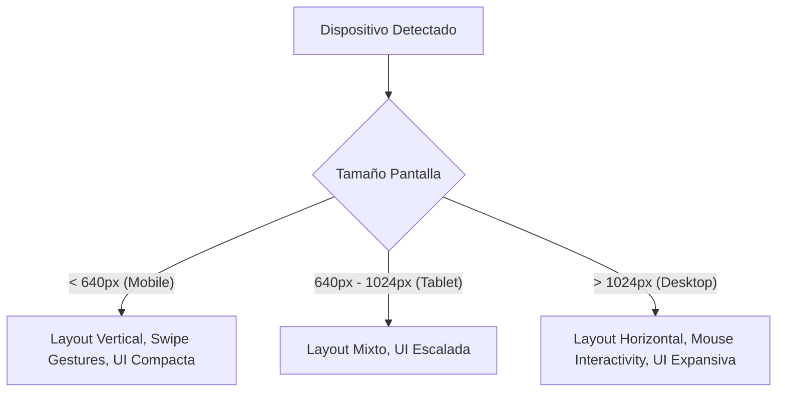

# ESTRATEGIA DE RESPONSIVIDAD TOTAL (MOBILE, TABLET, DESKTOP)

Para asegurar que la experiencia sea mágica en cualquier pantalla, implementaremos los siguientes pilares técnicos:

## 1. LAYOUT ADAPTABLE (MOBILE-FIRST)
- **Viewport Units & Relative Sizing:** Sustituir medidas fijas (px) por porcentajes, `vw/vh` o `rem` en contenedores principales.
- **Flex/Grid dinámico:** El Collage pasará de 3 columnas (Desktop) a 2 (Tablet) y 1 (Mobile) automáticamente usando breakpoints de Tailwind.
- **Tipografía Fluida:** Uso de `text-balance` y escalas de fuente que se reducen en móviles para evitar desbordamientos de títulos largos.

## 2. INTERACCIONES TÁCTILES & GESTOS
- **Framer Motion Gestures:** Asegurar que `dragConstraints` se calculen dinámicamente según el tamaño de la pantalla.
- **Swiping:** Implementar detección de gestos `swipeLeft` y `swipeRight` en el `SlideManager` para navegar sin necesidad de botones pequeños.
- **Áreas de Toque:** Aumentar el área de "hitbox" de los elementos dragables (Curita, Brazos) para dedos en lugar de punteros.

## 3. COMPONENTES ESCALABLES
- **SVGs Responsivos:** Usar `preserveAspectRatio="xMidYMid meet"` y contenedores con `aspect-ratio` para que el corazón y los brazos no se deformen ni pierdan su centro.
- **Music Player Adaptable:** En móviles, el reproductor de Spotify se reducirá o se convertirá en un botón flotante más compacto para no cubrir el contenido.

## 4. OPTIMIZACIÓN DE RENDIMIENTO
- **Lazy Assets:** Carga diferida de imágenes pesadas del collage.
- **Reduce Motion:** Respetar las preferencias del sistema para usuarios que prefieren menos animaciones.

Esta estrategia garantiza que, ya sea que ella vea el detalle en su teléfono mientras viaja o en una tablet cómodamente, la emoción y la magia permanezcan intactas.